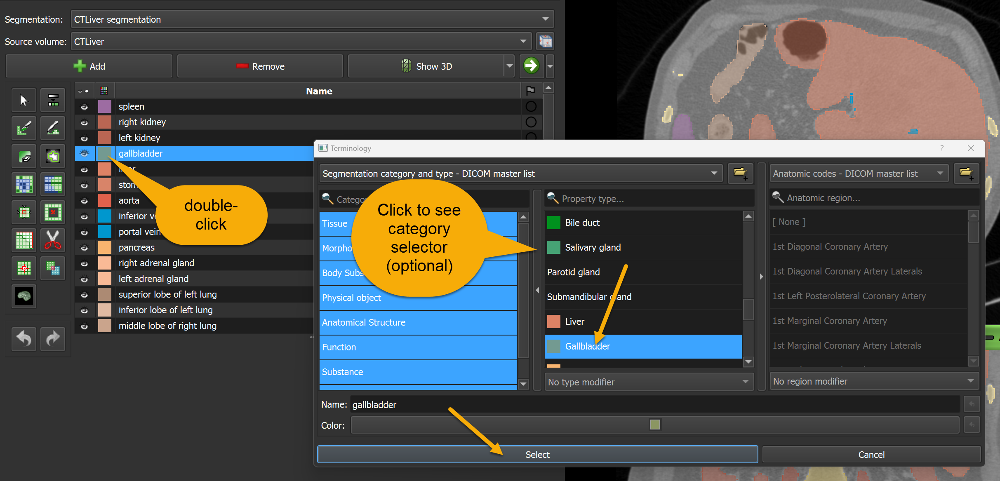
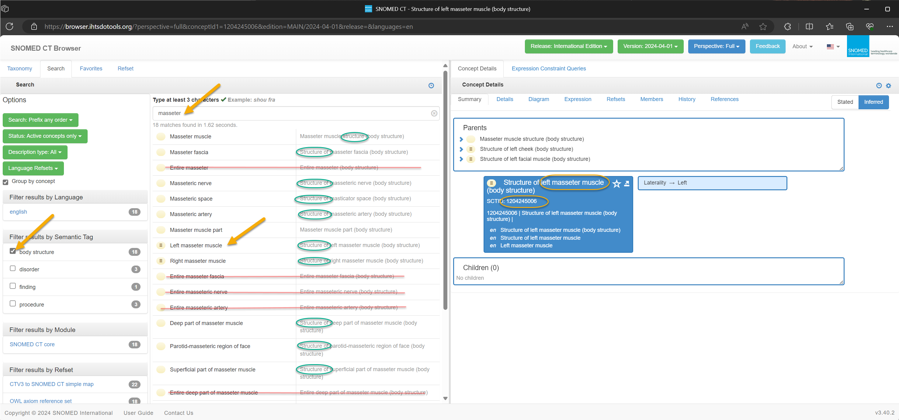
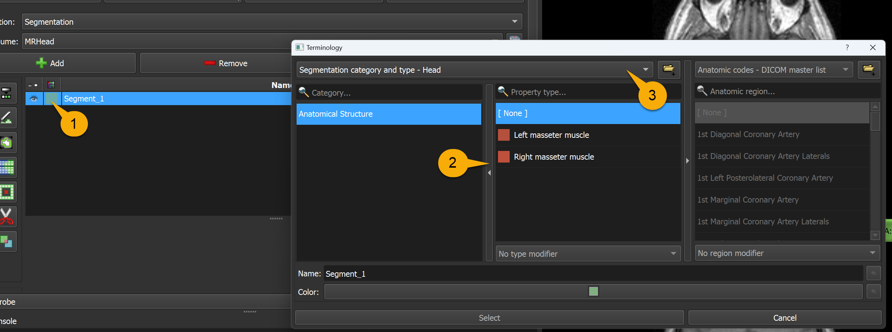

# Standard terminology for segmentation

## Overview

Segmentation tools usually provide a labelmap volume as output, with each label (voxel) value corresponding to a segment. To define the meaning of each label, it is common practice to provide a mapping from label value to a "segment name". Segment name is often just a simple common English name for an anatomic structure. Unfortunately, using such names are very error-prone, as there could be many different variants for the same word (e.g., `Left Lung`, `Lung, Left`, `left lung`, or `esophagus`, `Oesophagus`, `oesophagus` ...), the meaning of the name may not be exactly defined, and due to inconsistencies (in capitalization, order of words, usage of separator characters, etc.) matching of segment names may fail.

To avoid these issues, standard terms can be used to specify what each segment represents. A standard term has well-defined meaning, thus allowing aggregating data from many sources, and since they have to be selected from a predefined list, there is no risk of typos or inconsistencies that often occur when typing free text.

Terminology is a `dict` that must specify `category` and `type` codes and may optionally also specify `typeModifier`, `anatomicRegion`, and `anatomicRegionModifier`. Each code is specifed by a triplet of "coding scheme designator", "code value", "code meaning" in a list.
`Coding scheme designator` is typically `SCT` (SNOMED-CT) for clinical images. You can find codes in the [SNOMED-CT browser](https://browser.ihtsdotools.org/). `Code value` is a unique string within the coding scheme, most commonly an integer number. `Code meaning` (third component of codes, such as "Anatomical Structure", "Ribs", "Right") is informational only, it can be used for troubleshooting or displayed to the user, but it is ignored in information processing (e.g., two codes match if their coding scheme designator and code value are the same even if code meaning is different).

According to the DICOM standard, content of a segment is specified by its `category` (such as "Anatomical structure", "Physical object", "Body substance", ...) and `type` (such as "Liver" or "Cardiac Pacemaker", ...). Optionally a modifier (`typeModifier`, such as "left" or "right") and anatomical location (`anatomicRegion` and `anatomicRegionModifier`) can be specified as well. Each of these are specifed by a standard code, which is a triplet of "coding scheme designator", "code value", and "code meaning":
- `Coding scheme designator` is a string identifying the terminology. It is typically set to `SCT` (SNOMED-CT) for clinical images. However, Uberon (`UBERON`), Foundational Model of Anatomy (`FMA`) and [others](https://dicom.nema.org/medical/dicom/current/output/chtml/part16/chapter_8.html) may be used, too.
- `Code value` is a unique string within the coding scheme, most commonly an integer number.
- `Code meaning` is a human-readable meaning of the term (such as "Anatomical Structure", "Ribs", "Right"). It is informational only: it can be used for troubleshooting or displayed to the user, but it is ignored in information processing. For example, two codes match if and only if their coding scheme designator and code value are the same; it does not matter the if code meaning values are the same.

## How to get standard codes for describing segment content

### Specifying term for a segment during segmentation

3D Slicer comes with a [number of terminologies](https://github.com/Slicer/Slicer/blob/main/Modules/Loadable/Terminologies/Resources) that contain the most commonly used terms. You can select them by clicking the colored box in the segment list.



### How to add custom terms

If you work with less commonly used structures then there is a chance that the the term you need is not included in the list of terms that are bundled with Slicer.

In this case, you can have a look if you can find the term in [DICOM controlled terminology definitions](https://dicom.nema.org/medical/dicom/current/output/chtml/part16/chapter_d.html).

If it is not available there either then you can find the SNOMED CT terminology code by following these steps:
- Go to [SNOMED CT browser](https://browser.ihtsdotools.org/), accept the license agreement
- Click "Go browsing international edition"
- Check the "body structure" checkbox on the left side in "Filter results by Semantic Tag" section
- In the search box, type the structure you segment - for example: `masseter`
- Click on the relevant item in the list below, for example `Left masseter muscle`.
  - *Tip:* ignore the items that start with `Entire` word, as it has a special meaning (that the segment is guaranteed to contain the entire structure and not just a part of it), which is hard to guarantee in practice, therefore such codes are not used in DICOM (with a very few exceptions). Instead, select the item that has description starting with `Structure of` or ends with `structure`.
- The information that you need are the structure name and SCTID values that are displayed on the right side in "Concept details" section, For example, `left masseter muscle` and `1204245006`. Since the code meaning is not used for exact matching, it is acceptable to simplify it (for example, remove the `Structure of` prefix or `structure` suffix).



#### How to make these additional terms selectable in 3D Slicer

1. Create a new text file and save it with `.term.json` file extension, for example `SegmentationCategoryTypeModifier-Head.term.json` that contains the list of the terms you want to use. For example:

```json
{
  "SegmentationCategoryTypeContextName": "Segmentation category and type - Head",
  "@schema": "https://raw.githubusercontent.com/qiicr/dcmqi/master/doc/segment-context-schema.json#",
  "SegmentationCodes": {
    "Category": [
      {
        "CodingSchemeDesignator": "SCT", "CodeValue": "123037004", "CodeMeaning": "Anatomical Structure",
        "showAnatomy": false,
        "Type": [
          { "CodingSchemeDesignator": "SCT", "CodeValue": "1204245006", "CodeMeaning": "Left masseter muscle", "recommendedDisplayRGBValue": [180, 80, 60] },
          { "CodingSchemeDesignator": "SCT", "CodeValue": "1204246007", "CodeMeaning": "Right masseter muscle", "recommendedDisplayRGBValue": [190, 80, 60] }
        ]
      }
    ]
  }
}
```

2. Drag-and-drop this file into the 3D Slicer application window. This adds the file to the list of custom terminologies. If everything goes well then no message will be displayed.

3. Double-click the colored rectangle to open the terminology selector, click the left-arrow button to show the terminology context selector, and select your terminology. For example, `Segmentation category and type - Head`


